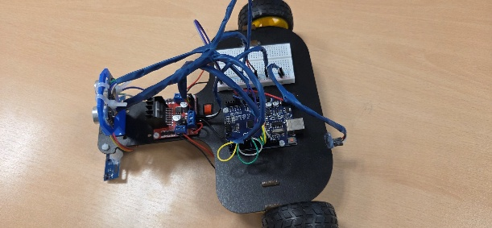
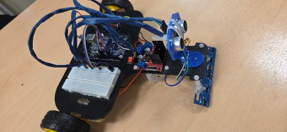

# Autonomous Differential-Drive Line Following Robot with PID & Dual FSM



An autonomous differential-drive mobile robot engineered for high-speed track navigation, sharp curve acquisition, and ultrasonic obstacle avoidance. Developed as the capstone robotics project for **ME0551: Robotics** at the **German Jordanian University (GJU)**.

---

## Technical Highlights

- **PID Closed-Loop Steering:** Continuously computes lateral deviation error from a multi-channel infrared reflectance array to balance differential motor speeds.
- **Exponential Moving Average (EMA) Filtering:** Real-time software filtering on analog photodiode inputs to attenuate high-frequency electrical noise and surface reflections without phase lag.
- **Dual-Phase Turn FSM:**
  - `ACQUIRE`: High-speed pivot (`155 PWM`) for immediate line recovery when track loss is detected on sharp 90° bends.
  - `CENTERING`: Low-speed fine pivot (`135 PWM`) to damp momentum and align the vehicle precisely on the track centerline.
- **Timed Obstacle Bypass FSM:** Triggered by front ultrasonic range sensing ($< 5\text{ cm}$), executing a non-blocking three-stage maneuver (`AVOID_RIGHT` $\to$ `AVOID_FORWARD` $\to$ `AVOID_LEFT`) before resuming PID tracking.
- **Deterministic Non-Blocking Architecture:** Zero `delay()` calls in the main execution loop, guaranteeing high sensor polling rates and responsive actuator updates via `millis()` state scheduling.

---

## Hardware Architecture & Bill of Materials

| Subsystem | Component | Role |
| :--- | :--- | :--- |
| **Controller** | Arduino Uno (ATmega328P) | Core real-time processing and PWM generation |
| **Actuation** | L298N Dual H-Bridge Driver | Independent bi-directional DC motor control |
| **Motors** | 2× Geared DC Motors (6V) | Differential drive wheels with high-grip rubber tires |
| **Line Perception** | 5-Channel IR Reflectance Array | Track contrast detection (black line on white surface) |
| **Obstacle Sensing** | HC-SR04 Ultrasonic Sensor | Forward collision detection mounted on elevated bracket |
| **Chassis** | Custom Laser-Cut Acrylic/MDF | Designed in AutoCAD (`cad/Draft1linerRob.dwg`) with rear caster |



---

## Controller Tuning & Parameter Configuration

Through empirical testing on tight hairpins and straight dashed lines, the control loop was tuned with the following parameters:

```c
// Speed Limits (8-bit PWM)
const int BASE_SPEED          = 125;
const int SLIGHT_SPEED        = 110;
const int PIVOT_ACQUIRE_SPEED = 155;
const int PIVOT_CENTER_SPEED  = 135;
const int MAX_SPEED           = 180;
const int MIN_SPEED           = 80;

// PID Parameters
float Kp = 16.0;  // Proportional gain for rapid lateral response
float Ki = 0.1;   // Integral gain to eliminate steady-state offset
float Kd = 12.0;  // Derivative gain to anticipate curvature and damp oscillations

// Anti-Windup and Clamping Bounds
integral   = constrain(integral, -60, 60);
derivative = constrain(error - lastError, -2.0, 2.0);
pid_output = constrain(pid, -35, 35);
```

### Why Derivative Clamping & EMA?
Standard differential line trackers suffer from "derivative kick" when transitioning over dashed lines or textured floor joints. By applying a digital EMA filter ($\alpha = 0.35$) and bounding the derivative term to $[-2.0, 2.0]$, the robot maintains smooth trajectories without violent oscillations.

---

## Repository Structure

```text
├── README.md                          # Project documentation and control design
├── firmware/
│   └── LineFollower_PID_FSM.ino      # Complete Arduino C++ firmware
├── cad/
│   └── Draft1linerRob.dwg            # AutoCAD chassis drawing
├── media/
│   ├── robot_front_view.jpg          # Hardware prototype front view
│   ├── robot_angled_view.jpg         # Prototype layout and sensor bar
│   ├── pid_controller_code.png       # Implementation snippet
│   └── obstacle_avoidance_code.png   # FSM implementation
└── docs/
    └── Line_Following_Robot_Summary.pdf # University submission summary
```

---

## Team

- **Ramez AlMasadeh** — Control Architecture, PID Tuning & Firmware Implementation
- **Abdullah AlBakri** — Circuit Design & Hardware Integration
- **Ahmad Alamir** — Mechanical Chassis & CAD
- **Yazan Kanakri** — Sensor Calibration & Testing

**Department of Mechatronics Engineering**  
School of Applied Technical Sciences (SATS)  
German Jordanian University (GJU)